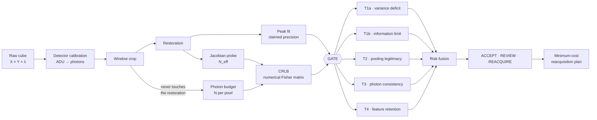

<div align="center">



<br>


**We do not make your measurement look better.  
We tell you which parts of it are real.**

</div>

---

## The 16.8× problem

We tuned a standard spatial smoothing filter on Raman maps with known ground truth. It came back with:

| Metric | Result | Reading |
|:--|:--|:--|
| Effective exposure gain | **16.8×** | best in the comparison |
| RMSE | **0.0103 cm⁻¹** | best in the comparison |
| False-feature rate | **0.0000** | perfect |
| **Defect recall below 2 CRLB** | **0.000** | **found nothing** |

Every conventional quality metric said it was the best method available. It had erased **80% of the real
defects** and manufactured none, because it manufactured nothing at all — the zero false-feature rate was
not cleanliness, it was a method that produces no features.

Then we trained a neural network with a defect-preservation constraint. It arrived at the same trade by a
completely different mechanism: 1.29× gain, recall at the detection limit falling from 0.719 to 0.548.
Two independent routes, one conclusion.

> **On shot-noise-limited spectroscopic maps, you cannot buy speed without erasing the features you were
> measuring for — and no conventional metric will tell you it happened.**

That is what this repository is for.

---

## What OptiGuard does

Instead of asking *does the output look right*, it asks a question with a physical answer:

> **Given the photons that actually arrived at this point, is the reported value possible?**

The Cramér–Rao lower bound sets the best precision achievable on a peak position from a given photon count.
It is a law, not a benchmark — no algorithm beats it. So a restoration claiming precision beyond its own
photon budget is provably fabricating information, whatever its error metrics say.

```
     13.7 min fast scan       →   flag the 1.8% that cannot be certified
  +  0.6 min sparse re-scan  →   re-measure only those points
  -------------------------
    14.3 min, certified          vs 34.1 min for a careful scan of everything
```

---

## Pipeline



The right-hand branch never touches the restoration. **The bound comes from the photons, so it can judge any
restoration — including one that produces a convincing lie.**

---

## The five tests

<details>
<summary><b>T1a — Variance deficit</b> · did the processing remove noise the photons should have produced?</summary>

<br>

Reduced χ² of the fit residuals against the Poisson expectation. Around 1.0 means the data behaves as the
physics predicts. Well below 1.0 means variance was removed — smoothing.

Fires on **any** denoiser, including good ones. On its own it is a detector, not a verdict.

| Method | χ²ᵥ | T1a |
|:--|--:|:--|
| raw (identity) | 1.013 | quiet |
| Gaussian σ=2 | 0.022 | 100% |
| network | 1.008 | quiet |

</details>

<details>
<summary><b>T1b — Information limit</b> · is the claimed precision physically possible? <i>(the core mechanism)</i></summary>

<br>

Compares residual-scaled precision against `CRLB / √N_eff`, where `N_eff` is the **effective pooled photon
budget** measured from the restoration's own input–output Jacobian.

The subtlety that makes this work: a legitimate spatial denoiser *should* beat the single-pixel bound,
because it borrows photons from neighbours. So the bound must be evaluated against the photons it actually
used — and pooling credit is granted only when it has been **measured and disclosed**.

| Case | T1b |
|:--|:--|
| Gaussian claiming `N_eff = 1.0` | **100% fail** — pooled 50 pixels, claimed it pooled none |
| Gaussian disclosing `N_eff = 50.3` | 2.4% — honest, and passes |

</details>

<details>
<summary><b>T2 — Pooling legitimacy</b> · was the neighbourhood it averaged actually uniform?</summary>

<br>

Tests the raw spectra across the pooling support against a locally linear model. Averaging across a material
boundary or a small defect contaminates the estimate — this is the mechanism by which small features get
erased.

**Known limitation, disclosed:** this test reads the raw neighbourhood only, so it flags the same pixels
regardless of which restoration was used. It cannot currently discriminate between methods.

</details>

<details>
<summary><b>T3 — Photon consistency</b> · could the restored spectrum have produced the observed counts?</summary>

<br>

χ² of observed counts against the restored spectrum under Poisson statistics. Catches gross alterations such
as a shifted peak.

**Known limitation, disclosed:** sensitivity is diluted when only a few channels were modified. A ±3-count
perturbation across 36 channels is invisible against 1024 degrees of freedom.

</details>

<details>
<summary><b>T4 — Feature retention</b> · did a feature the photons support survive? <i>(the one that matters)</i></summary>

<br>

T1a–T3 all ask about noise and precision claims. **None asks whether a feature present in the input is still
present in the output.** T4 closes that gap: for every pixel where the raw photons support a local peak
deviation, is it still there?

Full corpus, 6 maps, 209 supported defects:

| Method | Supported defects erased | Rate |
|:--|--:|--:|
| raw (identity) | **0 / 209** | **0.0%** |
| Gaussian σ=2 | 168 / 209 | 80.4% |
| network | 18 / 209 | 8.6% |

The identity null is **exactly** zero, not approximately zero. That is what makes the other two numbers
mean something.

</details>

---

## Measured results

Every number below traces to a file in [`evidence/`](evidence/).

| Quantity | Measured | Cross-check |
|:--|--:|:--|
| Estimator efficiency | **1.002 × CRLB** | empirical scatter vs numerical Fisher bound |
| Reference exposure gain | **49.3×** | predicted 50× from a 5.0 s / 0.1 s ratio |
| Reference RMSE/CRLB | **0.135** | predicted 0.142 = 1.002/√50 |
| Effective-pooling probe | **50.26** | analytic 4πσ² = 50.27 for σ = 2.0 |
| Identity through the gain metric | **0.980×** | must be 1.00 by construction |
| T4 identity null | **0 / 209** | must be exactly zero |
| OOD in-distribution null | **4.84%** | designed 5% FPR |
| OOD AUROC, all materials | **1.000** | with a measured failure point at ΔFWHM ≈ 0.25 cm⁻¹ |
| Planner closed-loop ratio | **0.999** (0.92 – 1.10) | predicted vs achieved, 72 cases |

---

## What we found by breaking it

Three times during development, our own training objective was gamed by the model. Every one produced an
excellent-looking loss curve. Every one was caught by the physics-based gate and **none** by the training
metric.

| # | Exploit | What the model did | What caught it |
|:--|:--|:--|:--|
| 1 | **Softmax quantisation** | Loss fell to 0.16 CRLB while restoring nothing | Clean-spectrum known-answer check: 3.09 CRLB error on *noiseless* input |
| 2 | **Edge lever-arm** | Perturbed outer channels by 1–2 counts to move a centre-of-mass 35 cm⁻¹ away | Edge differential: 1.93 counts at edges, 0.65 at the peak |
| 3 | **Baseline wedge** | Built an asymmetric pedestal under the peak to shift its centroid without restoring it | Training centroid 0.0121 vs harness fit 0.0300 cm⁻¹ |

The failure mode this product exists to detect appeared, unbidden, three times in our own work. It is the
strongest argument we have for why the gate must be independent of the model it audits.

---

## Method

**Every real bug in this project surfaced from a known-answer check — never from a loss curve.**

| Check | Known answer | What it caught |
|:--|:--|:--|
| Thinned vs directly simulated counts | same distribution | noise-model errors |
| Empirical scatter vs CRLB | ratio 1.0 | fitter inefficiency |
| Noiseless spectrum through the centroid | ≪ 0.1 CRLB | softmax quantisation |
| Reference exposure gain | ≈ 50× | metric clamping |
| Gaussian σ=2 through the N_eff probe | 4πσ² = 50.27 | probe validity |
| Identity through the gain metric | 1.00× | metric offset |
| Raw as null, stratified by difficulty | flat across tiers | false attribution to the model |
| `crlb_plugin_map` vs `crlb_peak_position` | agree to a few % | **3.2× error in the bound** |
| Identity through T4 | exactly 0 | T4 false-positive floor |

Construct a case where you know the answer analytically, then check the machinery reproduces it. Loss curves,
green test boards and confident summaries surfaced none of the sixteen bugs we found.

---

## Physics

<details>
<summary><b>Why a short exposure is a thinned long exposure — and why that matters</b></summary>

<br>

Training a restoration model needs pairs: a degraded input and a clean target. Most work invents the
degradation — Gaussian blur, additive noise, hand-tuned ranges. That invites a fair objection: the model is
being tested against the same assumptions that generated its training data.

For photon counting there is no need to invent anything. If arrivals are Poisson with rate λ, then counts in
time `T` are `Poisson(λT)`, and **binomially thinning those counts by `t/T` gives exactly `Poisson(λt)`** —
the distribution of a genuine `t`-second acquisition.

```python
N_short = rng.binomial(N_long, t / T)      # exactly distributed as a real short exposure
```

Consequences:
- The training distribution matches reality with no tuned parameters.
- The circularity objection dissolves: the pairing is a theorem, not a modelling choice.
- Any long-exposure map becomes unlimited training data at every shorter exposure.
- **Read noise and dark current do not thin.** They are per-readout and per-time respectively, and must be
  added separately. Getting this wrong is the most likely implementation bug, so there is a unit test for it.

</details>

<details>
<summary><b>The Cramér–Rao bound, computed rather than assumed</b></summary>

<br>

```
FIM[i,j]  =  Σ_k  (∂μ_k/∂θ_i)(∂μ_k/∂θ_j) / (μ_k + σ_read²)
σ_min(θ_i) =  √( [FIM⁻¹][i,i] )
```

Three traps, each of which cost us time:

1. **Invert the full matrix.** `1/FIM[0,0]` gives the bound assuming linewidth, amplitude and background are
   known exactly. It is too optimistic and surfaces as a keystone-test failure that looks like a CRLB bug but
   is a marginalisation bug.
2. **`amplitude` is peak height, not integrated signal.** Passing the integral underestimated our bound by
   **3.2×** — √9.18 ≈ 3.03 — in production-path code, invisible until the gate exposed it.
3. **σ ∝ 1/√N is not general.** It holds in the pure shot-noise limit. Read noise is fixed per readout, so as
   counts grow it dilutes and you need *less* than 4× the photons to halve σ. Our planner inverts the bound
   numerically; measured k = 3.88 where the naive law says 4.00.

</details>

<details>
<summary><b>Effective pooled photon budget</b></summary>

<br>

A good spatial denoiser legitimately beats the single-pixel bound by borrowing photons from neighbours.
So how many did it borrow?

From the restoration's local Jacobian `J_pq = ∂λ̂_p/∂x_q`, form normalised weights and compute the effective
sample size:

```
N_eff(p) = ( Σ_q w_pq · N_q )²  /  ( Σ_q w_pq² · N_q )
```

For uniform pooling over `M` equivalent pixels this correctly returns `M·N`. Validated against a Gaussian
kernel with σ = 2.0: **measured 50.26, analytic 4πσ² = 50.27.**

The bound for a pixel is then `CRLB(N_eff)`, not `CRLB(N_raw)`.

</details>

---

## Quick start

```bash
git clone https://github.com/yashwanth-maram/Optiguard.git && cd Optiguard
python -m venv .venv && source .venv/bin/activate     # Windows: .venv\Scripts\activate
pip install -e ".[dev,train,serve]"

pytest tests/test_physics.py -v        # 11/11 — the physics must be green first
python apps/serve.py                   # console at http://127.0.0.1:8000
```

<details>
<summary><b>Running it on real data</b></summary>

<br>

**Check the file is usable before building anything on it.** Processed data breaks every assumption
downstream, silently.

```bash
python scripts/ingest_real.py check data/your_file.mat
```

The decisive test is a photon transfer curve — variance against mean across intensity levels. For genuine
counting data that is a straight line whose slope gives the detector gain and whose intercept gives the read
noise. **The same procedure that validates the data also measures the constants**, which is useful when a
facility cannot supply them.

```bash
python scripts/ingest_real.py map data/cube.npy --axis data/axis.npy \
    --gain 2.4 --read-noise 4.0 --nominal-center 520.7 --out evidence/real.json
```

</details>

---

## Architecture

```
optiguard-ai/
├── src/optiguard/
│   ├── physics/          detector · lineshapes · thinning · crlb        ← the bedrock
│   ├── data/             simulator with ground-truth parameter fields
│   ├── estimation/       vectorised Poisson-weighted peak fitting
│   ├── models/           spatial–spectral restoration network
│   ├── assurance/        pooling (N_eff) · gate (T1a–T4) · ood          ← the IP
│   ├── planning/         required photons → settings → sparse mask      ← the IP
│   ├── eval/             harness · classical baselines
│   └── api/              schemas and routes
├── apps/                 serve.py (FastAPI) · static console
├── evidence/             every measured result, committed
├── tests/                the specification — written before the code
└── scripts/              corpus generation · ingestion · benchmarks
```

**Deployment is on-premise by design.** Semiconductor and materials customers will not send inspection data
off-site, cubes run to gigabytes, and the natural home for this is the instrument PC. No cloud, no outbound
calls, one container.

---

## Status

| Phase | Steps | State |
|:--|:--|:--|
| Physics foundation | 0–6 | ✅ verified in two independent environments |
| Measurement & baselines | 7–8 | ✅ the central finding, measured |
| Assurance gate | 9–11, 13 | ✅ calibrated against known answers |
| Planner & console | 12, 14 | ✅ closed-loop validated in simulation |
| **Physical validation** | 15 | ⬜ **instrument access in progress** |

**We have not yet acquired data on a commercial instrument.** Everything above is validated against a
physics-exact simulation environment with known-answer verification at every stage. Instrument-level
validation is the defined next step and we do not claim it. That boundary is stated here for the same reason
the product exists.

---

<div align="center">

**Prepared for HORIBA Innovation Connect 2026** · Spectroscopy, Optics & Photonics

*Full development record, including retracted findings and documented failure modes:*  
[`evidence/BUILD_RECORD.md`](evidence/BUILD_RECORD.md)

</div>