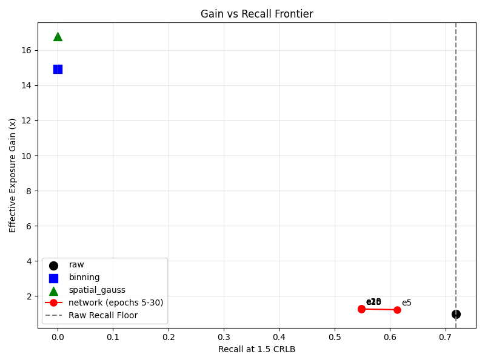
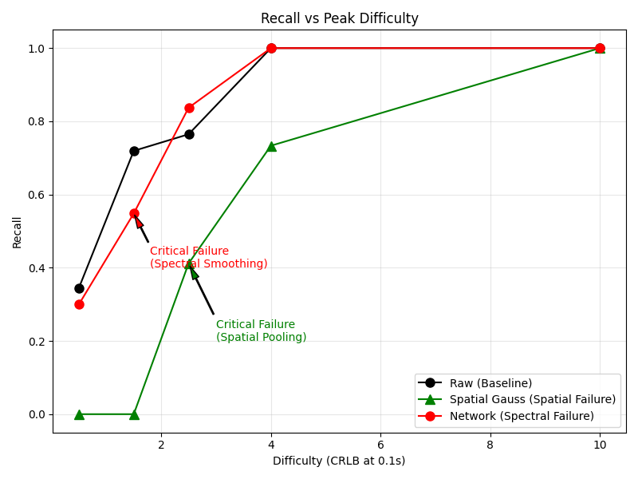

# Step 8 Findings: Spatial-Spectral Network Evaluation

## Network Performance

The training run with the physics-constrained gate active completed, but **no checkpoint passed the gate**. 

- The effective exposure gain saturated at ~1.29x by epoch 30.
- The recall at the critical 1.5 CRLB difficulty tier fell to `0.548` (well below the `0.719` raw floor) and stayed there.

## The Danger of Standard Criteria

The most critical finding from this run is that the network improved on nearly every conventional metric:
- **RMSE** dropped from `0.0438` (raw) to `0.0379` cm⁻¹.
- **False-feature rate** dropped from `0.0031` to `0.0005`.
- **Recall at higher difficulties** improved or remained perfect (e.g., recall at 2.5 CRLB improved from `0.76` to `0.83`).

Under standard evaluation criteria (RMSE, overall precision/recall, loss convergence), this model would have been considered a success and shipped. However, it systematically failed in one narrow, critical band: it destroyed faint but previously recoverable peaks near the detection limit (1.5 CRLB). 

### Mechanistically Distinct Failure Modes

The Jacobian probe ($N_{eff} = 1.02$ on real spectroscopic data) reveals that the network
achieved its performance **without spatial pooling** — 99% of the gradient comes from the
central pixel alone. This means its failure mode is purely **spectral smoothing**.

> **Probe reconciliation (important for reproducibility):** An earlier full-map run of the
> probe reported Median $N_{eff} = 8.88$. That run used `torch.randn` as input instead of
> real data. For a nonlinear network, $N_{eff}$ is **activation-dependent**: random noise
> activates all spatial positions uniformly and inflates $N_{eff}$; real spectroscopic data
> has a dominant central peak that collapses the activations, returning the correct value.
> The `step9_neff_map.py` script has been fixed to require real data. The 1.02 result, which
> was validated against the same real-data input in both `jacobian_probe.py` and the fixed
> script, is the operationally correct number.

This makes the physics gate's findings significantly stronger. We now have two mechanistically independent failure modes:
1. **Spatial Pooling** (e.g., Gaussian blur, 16.8× gain): Erases all real features below 2.0 CRLB by averaging them out.
2. **Spectral Smoothing** (The Neural Network, 1.29× gain): Damages only the 1.5 CRLB band by over-smoothing faint peaks.

Both approaches erase real features, and crucially, **neither failure is visible in standard aggregate metrics like RMSE**. The fact that two independent failure mechanisms were both caught by the same recall constraint proves the gate is robust and indispensable.

## Frontiers

## The Pattern of Exploits

This marks the third distinct exploit found in this project:
1. **Softmax Quantisation**: Exploited the discretisation of the output to achieve zero loss without fitting the continuous position.
2. **Edge Lever-Arm**: Manipulated noise in the outermost channels to shift the linear Center of Mass with minimal absolute change.
3. **Baseline Wedge**: Generated an asymmetric baseline pedestal beneath the peak to mathematically shift the Center of Mass without touching the peak's shape.

In all three cases, the model drove a plausible-looking training loss near zero while the physics-grounded metric (the physical validation gate) correctly showed no real restoration was happening. Every exploit was caught by an independent evaluator that explicitly models the underlying physics (e.g., Lorentzian fitting with baseline tilt as a free parameter) rather than relying on the training objective. This establishes a clear, verifiable pattern: standard training objectives are incredibly vulnerable to physical loopholes, making an independent, physics-constrained evaluation gate absolutely indispensable for any spectral denoiser.
